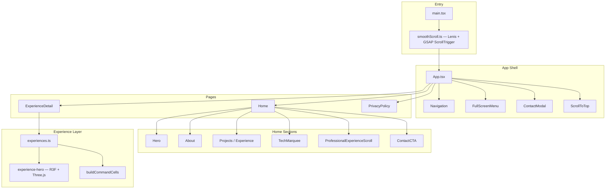

# Fairoz Portfolio 2026

[](https://react.dev/)
[](https://www.typescriptlang.org/)
[](https://vitejs.dev/)
[](https://tailwindcss.com/)
[](https://threejs.org/)

A production-grade personal portfolio engineered for **performance**, **motion design**, and **accessibility**. Built as a single-page application with immersive experience detail routes, WebGL hero sections, and a fully typed content layer.

**Live:** [fairoz.in](https://fairoz.in) · **Repository:** [github.com/Fairoz007/fairoz.in-2026](https://github.com/Fairoz007/fairoz.in-2026)

---

## Table of Contents

- [Overview](#overview)
- [Architecture](#architecture)
- [Features](#features)
- [Tech Stack](#tech-stack)
- [Routes](#routes)
- [Getting Started](#getting-started)
- [Scripts](#scripts)
- [Project Structure](#project-structure)
- [Content Management](#content-management)
- [Animation & Scroll System](#animation--scroll-system)
- [UI Component System](#ui-component-system)
- [Performance](#performance)
- [Deployment](#deployment)
- [Author](#author)
- [License](#license)

---

## Overview

This portfolio is a **digital resume and professional showcase** for Fairoz Faisal — Director of IT, infrastructure engineer, and full-stack developer. The site combines editorial typography, cinematic scroll experiences, and case-study-style experience pages backed by structured data.

Design goals:

| Goal | Implementation |
|------|----------------|
| Premium feel | Lenis smooth scroll + GSAP timelines + Framer Motion page transitions |
| Visual depth | WebGL liquid shaders, 3D monolith, grain overlay, glass-morphism panels |
| Maintainability | TypeScript everywhere, data-driven routes, shadcn/ui component primitives |
| Responsiveness | Mobile-first layouts, `100dvh` heroes, fluid `clamp()` typography |
| Accessibility | Radix UI primitives, semantic HTML, reduced-motion media queries |

---

## Architecture



**Data flow:** Static content lives in `src/data/`. Pages consume typed interfaces; experience slugs drive dynamic routing without a backend.

---

## Features

### Landing Page
- **Cinematic hero** with parallax scroll transforms and staged load animation
- **Story-scroll experience rail** — full-viewport pinned sections per role
- **Tech marquee** — infinite horizontal skill ticker
- **Grain overlay** — SVG noise texture for analog depth
- **Contact modal** — React Hook Form + Zod validation

### Experience Detail Pages (`/experience/:slug`)
- **WebGL hero** — custom GLSL liquid background + distorted icosahedron (`@react-three/fiber`, `@react-three/drei`)
- **Command deck** — glass panels for role, timeline, and tech stack
- **GSAP reveal** — blur-to-sharp entrance, staggered card animations, magnetic CTA
- **Dark case-study layout** — responsibilities, key projects, tech stack, company imagery
- **Prev / Next navigation** between experiences

### Global UX
- **Route-aware scroll reset** — every navigation opens at page top via Lenis
- **Back-to-top** floating action button
- **Full-screen mobile menu** with Lenis-anchored section links
- **Page transition loader** on initial app mount

---

## Tech Stack

### Core
| Layer | Technology |
|-------|-------------|
| Framework | React 19 |
| Language | TypeScript 5.9 |
| Bundler | Vite 7 |
| Routing | React Router DOM 7 |

### Styling & UI
| Layer | Technology |
|-------|-------------|
| CSS | Tailwind CSS 3.4 + CSS variables |
| Components | shadcn/ui (New York) on Radix UI |
| Icons | Lucide React |
| Variants | Class Variance Authority + `tailwind-merge` |

### Motion & 3D
| Layer | Technology |
|-------|-------------|
| Layout / gestures | Framer Motion 12 |
| Timelines | GSAP 3 + ScrollTrigger |
| Smooth scroll | Lenis 1.3 |
| WebGL | Three.js + React Three Fiber + Drei |

### Forms & Validation
| Layer | Technology |
|-------|-------------|
| Forms | React Hook Form 7 |
| Schema | Zod 4 |
| Resolvers | `@hookform/resolvers` |

---

## Routes

| Path | Component | Description |
|------|-----------|-------------|
| `/` | `Home` | Landing page with all sections |
| `/experience` | `ExperiencePage` | Redirects to home |
| `/experience/global-education` | `ExperienceDetail` | GES — Director of IT |
| `/experience/air-kerala` | `ExperienceDetail` | Air Kerala — ICT Executive |
| `/experience/phases-india` | `ExperienceDetail` | Phases India — System Administrator |
| `/privacy-policy` | `PrivacyPolicy` | Privacy policy page |

---

## Getting Started

### Prerequisites

- **Node.js** 20+ (LTS recommended)
- **npm** 10+

### Installation

```bash
# Clone
git clone https://github.com/Fairoz007/fairoz.in-2026.git
cd fairoz.in-2026

# Install
npm install

# Development
npm run dev
```

Open [http://localhost:5173](http://localhost:5173).

### Production Build

```bash
npm run build    # Type-check + Vite production bundle → dist/
npm run preview  # Serve dist/ locally
```

---

## Scripts

| Command | Description |
|---------|-------------|
| `npm run dev` | Dev server with HMR on port 5173 |
| `npm run build` | `tsc -b` then Vite production build |
| `npm run lint` | ESLint across the project |
| `npm run preview` | Preview production build locally |

---

## Project Structure

```
fairoz.in-2026/
├── public/
│   └── images/                    # Company logos & photography
├── src/
│   ├── components/
│   │   ├── ui/                    # shadcn/ui primitives + custom components
│   │   │   ├── experience-hero.tsx   # WebGL hero (R3F + GSAP)
│   │   │   ├── story-scroll.tsx        # Pinned scroll sections
│   │   │   └── marquee.tsx             # Infinite ticker
│   │   ├── Navigation.tsx
│   │   ├── FullScreenMenu.tsx
│   │   ├── ContactModal.tsx
│   │   └── ScrollToTop.tsx
│   ├── data/
│   │   └── experiences.ts         # Typed experience content + slugs
│   ├── hooks/
│   │   └── use-mobile.ts
│   ├── lib/
│   │   └── utils.ts               # cn() — clsx + tailwind-merge
│   ├── pages/
│   │   ├── Home.tsx
│   │   ├── ExperienceDetail.tsx   # Shared layout for all experience slugs
│   │   ├── ExperiencePage.tsx
│   │   ├── PrivacyPolicy.tsx
│   │   └── experience/
│   │       └── buildCommandCells.tsx
│   ├── sections/                  # Landing page sections
│   │   ├── Hero.tsx
│   │   ├── About.tsx
│   │   ├── Projects.tsx
│   │   ├── ProfessionalExperienceScroll.tsx
│   │   ├── TechMarquee.tsx
│   │   └── ContactCTA.tsx
│   ├── App.tsx                    # Routes, loader, global shell
│   ├── main.tsx                   # React root + BrowserRouter
│   ├── smoothScroll.ts            # Lenis singleton + GSAP ticker bridge
│   └── index.css                  # Tailwind layers, design tokens, utilities
├── components.json                # shadcn/ui configuration
├── tailwind.config.js
├── vite.config.ts                 # @ path alias
└── package.json
```

---

## Content Management

All professional experience content is defined in `src/data/experiences.ts`:

```typescript
export interface Experience {
  id: number;
  slug: string;           // URL segment → /experience/:slug
  title: string;          // Hero display title (e.g. "GLOBAL")
  titleScript: string;    // Outlined subtitle (e.g. "Education")
  companyName: string;
  role: string;
  duration: string;
  image: string;
  description: string;
  responsibilities: string[];
  keyProjects: { title: string; description: string; outcome: string }[];
  techStack: string[];
  gallery?: string[];
}
```

**To add a new experience:**

1. Append an object to the `experiences` array in `experiences.ts`
2. Add a company image to `public/images/`
3. The route `/experience/<slug>` is automatically available — no router changes needed

---

## Animation & Scroll System

```
Lenis (smoothScroll.ts)
  ├── rAF loop via gsap.ticker
  ├── ScrollTrigger.update on scroll
  └── lenis.scrollTo() used by Navigation, FullScreenMenu, ExperienceDetail CTA

GSAP
  ├── experience-hero: blur reveal, command-cell stagger, magnetic CTA
  └── story-scroll: pinned section timelines

Framer Motion
  ├── App: page loader exit, BackToTop, route AnimatePresence
  └── Sections: whileInView fades, parallax useScroll transforms
```

`ScrollToTop` resets Lenis + `window` scroll on every `pathname` change.

---

## UI Component System

Built on **[shadcn/ui](https://ui.shadcn.com/)** (New York style) with 50+ Radix primitives in `src/components/ui/`.

Add new shadcn components:

```bash
npx shadcn@latest add <component>
```

Path aliases (configured in `vite.config.ts` + `components.json`):

| Alias | Path |
|-------|------|
| `@/components` | `src/components` |
| `@/components/ui` | `src/components/ui` |
| `@/lib` | `src/lib` |
| `@/hooks` | `src/hooks` |

---

## Performance

- **Vite** — ESM-native dev server, Rollup production tree-shaking
- **Code splitting opportunity** — Three.js / R3F hero is the largest chunk; consider `React.lazy` for experience routes in future
- **Image assets** — served from `public/`; use WebP/AVIF for new uploads
- **Reduced motion** — `prefers-reduced-motion` overrides in `index.css` disable animations for accessibility

---

## Deployment

Build output goes to `dist/`. Deploy to any static host:

| Platform | Notes |
|----------|-------|
| **Vercel / Netlify** | Set build command `npm run build`, output `dist` |
| **GitHub Pages** | Set `base` in `vite.config.ts` if serving from a subpath |
| **Nginx / Apache** | SPA fallback: redirect all routes to `index.html` |

```bash
npm run build
# Upload dist/ to your host
```

---

## Author

**Fairoz Faisal**

- Website: [fairoz.in](https://fairoz.in)
- LinkedIn: [Fairoz Faisal](https://www.linkedin.com/in/fairoz-faisal-3233a7229/)
- Email: [hey@fairoz.in](mailto:hey@fairoz.in)
- GitHub: [@Fairoz007](https://github.com/Fairoz007)

---

## License

This project is **proprietary** and intended for personal use. All rights reserved.
